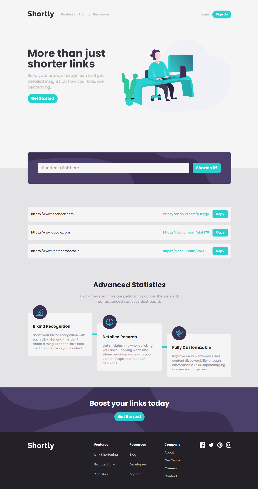

# LinkSnap - Modern URL Shortening Service

LinkSnap (powered by Shortly) is a modern URL shortening service built with React and Tailwind CSS. Transform long, unwieldy URLs into concise, shareable links with our sleek and user-friendly interface.



## Live Demo

- [Play around](https://link-snap-delta.vercel.app/)

## 🚀 Features

- Modern, responsive design across mobile, tablet, and desktop breakpoints
- Accessible UI with proper ARIA labels and semantic HTML
- Clean, minimalist interface focused on user experience
- Instant URL shortening service
- Mobile-first approach with a responsive hamburger menu
- Dark mode support for the UI components
- Stores the **latest three shortened links** in localStorage for quick access and displays them in the UI on subsequent visits.

## 🛠️ Tech Stack

- **Frontend Framework**: React 18.3
- **Styling**: Tailwind CSS 3.4
- **Build Tool**: Vite 6.0
- **Package Manager**: npm
- **API Integration**:
  - Vercel Serverless Function
  - [CleanURI API](https://cleanuri.com/docs) integration for URL shortening
- **Development Tools**:
  - ESLint for code quality
  - PostCSS for CSS processing
  - Autoprefixer for browser compatibility

## 🔗 URL Shortening Implementation

The application uses a Vercel serverless function to handle URL shortening requests:

- Secure proxy server implementation to bypass CORS restrictions
- Integration with CleanURI's API service
- Error handling for invalid URLs and API failures
- Response caching for improved performance
- Rate limiting protection

## 🎨 Layout & Design

The application features a modern, clean design with:

- Hero section with clear call-to-action
- Floating URL shortening form
- Advanced statistics section
- Responsive navigation with mobile menu
- Footer with comprehensive site links

### Responsive Breakpoints

- Mobile: < 768px
- Tablet: 768px - 1023px
- Desktop: ≥ 1024px

## 🌟 Accessibility Features

- Semantic HTML structure
- ARIA labels for interactive elements
- Keyboard navigation support
- Focus management in modal dialogs
- Screen reader friendly content structure
- Color contrast compliance

## 🏃‍♂️ Running the Project

1. Clone the repository:

```bash
git clone https://github.com/KeepSerene/link-snap-landing-page-react.git
```

2. Install dependencies:

```bash
npm install
```

3. Start the development server:

```bash
npm run dev
```

4. Build for production:

```bash
npm run build
```

## Author

_Dhrubajyoti Bhattacharjee_

- [GitHub](https://github.com/KeepSerene)
- [Portfolio](https://math-to-dev.vercel.app/)
- [LinkedIn](https://www.linkedin.com/in/dhrubajyoti-bhattacharjee-320822318/)

## 🤝 Contributing

Contributions are welcome! Please feel free to submit a Pull Request. For major changes, please open an issue first to discuss what you would like to change.

## 📝 License

This project is licensed under the MIT License - see the LICENSE file for details.
